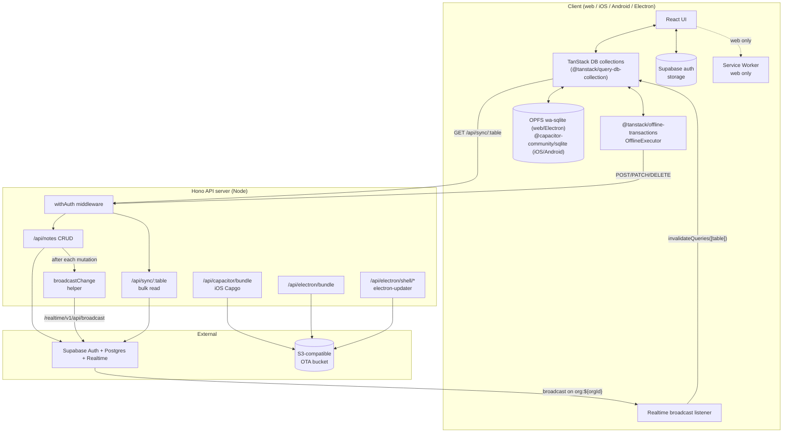
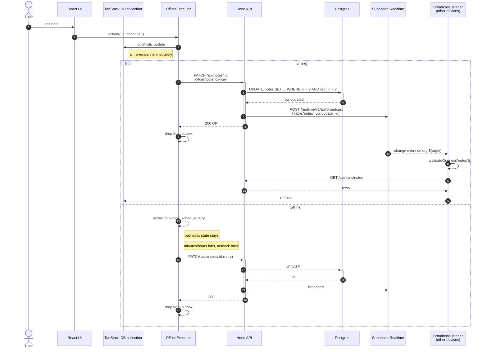
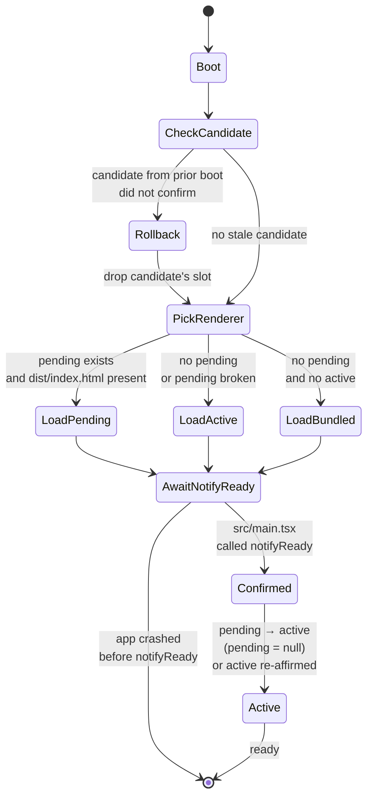
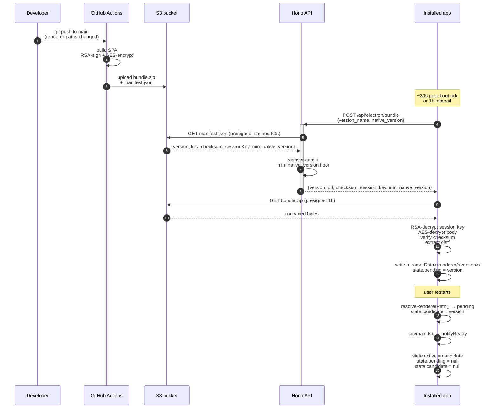

# Architecture

## Component diagram (C4-ish)

## Sync flow (sequence)

## OTA state machine (Electron renderer)

## OTA flow (publish + install)

## What lives where (file layout)

| Concern | Owner |
|---|---|
| Build/runtime config | `vite.config.ts`, `tsconfig.json`, `Caddyfile` |
| Vite SPA entry | `src/{main,App,router}.tsx` |
| Hono API | `examples/server-hono/server/{index,app}.ts`, `examples/server-hono/server/routes/*` |
| Auth seam | `examples/server-hono/server/middleware/auth.ts` |
| Response envelope | `examples/server-hono/server/lib/response.ts` |
| Sync read endpoint | `examples/server-hono/server/routes/sync.ts` (allowlist + org-filter) |
| Sync write endpoints | `examples/server-hono/server/routes/notes.ts` (or `<name>.ts` per collection) |
| Broadcast emit | `examples/server-hono/server/lib/broadcast.ts` |
| Sync provider | `lib/sync/TanStackDbProvider.tsx` |
| Sync collection pattern | `lib/sync/collections/{factory,notes}.ts` |
| Sync allowlist + scope helpers | `lib/sync/config.ts` |
| Offline outbox | `lib/sync/offline-executor.ts` (`@tanstack/offline-transactions`) |
| Broadcast listener | `lib/realtime/broadcast-listener.tsx` |
| Query client | `lib/query-client.ts` |
| Service Worker | `public/sw.js` |
| Electron main | `electron/main/{index,preload,tray,updater,renderer-ota}.ts` |
| Electron `app://` handler | `electron/main/index.ts` (`protocol.registerSchemesAsPrivileged` + `protocol.handle('app', …)`) |
| Electron auth backing | `electron/main/ipc/storage.ts` (safeStorage) |
| OTA signing | `.capgo_key_v2` (gitignored) + `setup-signing-key.sh` |
| OTA publish | `scripts/publish-{capacitor,electron}-bundle.sh` + `publish-electron-shell.sh` |
| OTA endpoints | `examples/server-hono/server/routes/{capacitor-bundle,electron-bundle,electron-shell}.ts` |
| OTA pickup | iOS: `@capgo/capacitor-updater` plugin auto-checks; Electron renderer: `electron/main/renderer-ota.ts` |

## Decisions worth knowing

- **Hash routing** — `createHashRouter` everywhere. The same React app
  works in dev, prod (Hono-served), Capacitor (`capacitor://localhost`),
  and Electron (`app://vitronitor/`) without server-side routing config
  or build-time base URL games.
- **`app://` for the Electron renderer** — `file://` origins are
  *opaque*: OPFS quota is undefined, Service Workers won't register,
  and shared-array-buffer features won't activate. We register `app://`
  as a privileged standard scheme and serve `dist/` through a
  `protocol.handle('app', …)` callback so the renderer runs under a
  real origin. The handler also injects a CSP per response — tampering
  with a downloaded OTA bundle past the checksum check can't escalate
  to remote-script execution.
- **Raw Electron, not Capacitor-Community-Electron** — Capacitor
  technically targets desktop via the Community Electron platform, but
  it's a thin wrapper that gives you a Capacitor-flavoured app, not a
  real Electron one: tray + multi-window + deep IPC + safeStorage +
  native Node modules in the main process all become second-class.
  Vitronitor builds its own Electron shell (`electron/main/`) and
  shares only the Vite/React renderer with Capacitor. Two purpose-built
  native shells, one renderer.
- **Read path is plain HTTP, not streaming** — `@tanstack/query-db-collection`
  fetches `GET /api/sync/:table` and TanStack Query owns the cache.
  Cross-device freshness comes from Supabase Realtime broadcasts on
  `org:${orgId}` triggering `invalidateQueries`. There's no bespoke
  long-poll or SSE protocol to host or operate — any backend that can
  return `{ ok: true, data: [...rows] }` and post a `change` payload
  to a pub/sub channel is enough.
- **Offline outbox via `@tanstack/offline-transactions`** — every write
  is wrapped in `executor.createOfflineAction({ mutationFnName, onMutate })`
  so it persists to the durable outbox before reaching the network.
  Retries thread an idempotency key; permanent failures (404/410/422)
  throw `NonRetriableError` so the entry dead-letters instead of
  looping forever. Survives full app crashes — not just tab closes.
- **SPA shell for prod** — Hono serves `dist/` with a `*` fallback to
  `index.html`. Electron uses the same `index.html` via the renderer-OTA
  resolver in production, served through `app://vitronitor/`.
- **Single-org default** — the `on_auth_user_created` Postgres trigger
  creates one workspace per new user. The `withAuth` middleware
  resolves `orgId` to the user's first `org_members` row. Multi-org is
  a documented extension: drop the trigger, send `X-Org-Id` from the
  client, and tear down + recreate the sync collections on switch.
- **One key signs both OTAs** — `.capgo_key_v2` signs both iOS Capgo
  and Electron renderer bundles. Same RSA-PKCS1 + AES-128-CBC wire
  format, same public PEM in two files (`capacitor.config.ts` +
  `electron/main/renderer-ota.ts`).
