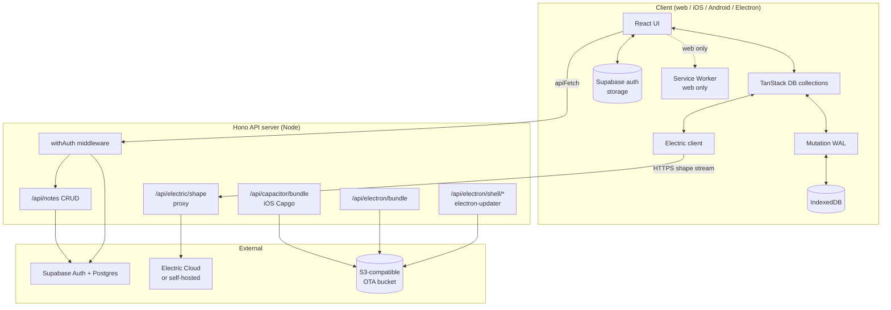
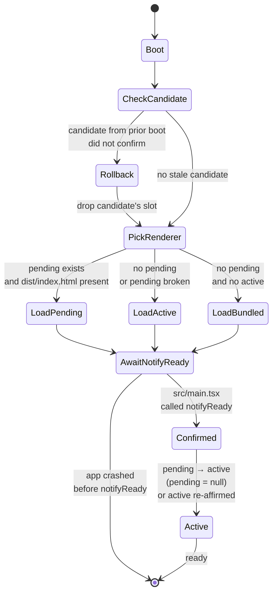
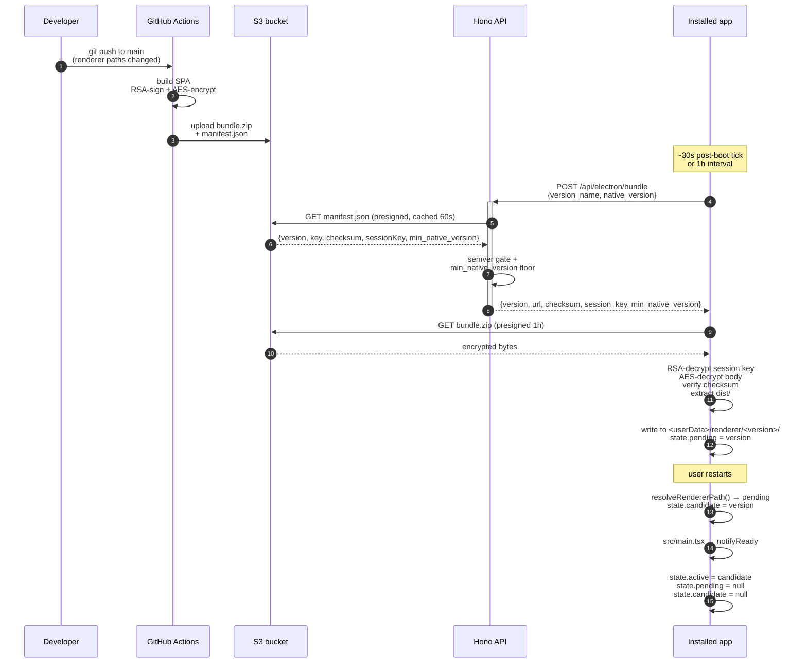

# Architecture

## Component diagram (C4-ish)



## Sync flow (sequence)

```mermaid
sequenceDiagram
    autonumber
    actor U as User
    participant UI as React UI
    participant C as TanStack DB collection
    participant W as Mutation WAL
    participant Q as Queue processor
    participant API as Hono API
    participant DB as Postgres
    participant E as Electric

    U->>UI: edit note
    UI->>C: collection.update(id, changes)
    Note right of C: optimistic UI<br/>updates immediately

    C->>W: persist mutation
    W->>+API: PATCH /api/notes/:id

    alt online
        API->>+DB: UPDATE notes SET ... WHERE id = ? AND org_id = ?
        DB-->>-API: row updated
        API-->>-W: 200 OK
        W->>W: drop from WAL
        DB->>E: WAL → publication
        E-->>C: shape event
        C->>UI: re-render with confirmed state
    else offline
        W-->>-W: keep mutation, schedule retry
        Note right of W: optimistic state stays
        Note right of Q: hours later, online event
        Q->>W: drainPendingMutations(orgId)
        W->>+API: PATCH /api/notes/:id (retry)
        API->>+DB: UPDATE
        DB-->>-API: ok
        API-->>-W: 200
        W->>W: drop from WAL
        DB->>E: publish
        E-->>C: shape event
        C->>UI: re-render
    end
```

## OTA state machine (Electron renderer)



## OTA flow (publish + install)



## What lives where (file layout)

| Concern | Owner |
|---|---|
| Build/runtime config | `vite.config.ts`, `tsconfig.json`, `Caddyfile` |
| Vite SPA entry | `src/{main,App,router}.tsx` |
| Hono API | `examples/server-hono/server/{index,app}.ts`, `examples/server-hono/server/routes/*` |
| Auth seam | `examples/server-hono/server/middleware/auth.ts` |
| Response envelope | `examples/server-hono/server/lib/response.ts` |
| Sync provider | `lib/electric/TanStackDbProvider.tsx` |
| Sync collection pattern | `lib/electric/collections/{factory,notes}.ts` |
| Offline persistence | `lib/electric/storage/{persistence-adapter,types}.ts` + adapters |
| Offline mutations | `lib/electric/{mutation-wal,mutation-queue-processor}.ts` |
| Service Worker | `public/sw.js` |
| Electron main | `electron/main/{index,preload,tray,updater,renderer-ota}.ts` |
| Electron auth backing | `electron/main/ipc/storage.ts` (safeStorage) |
| OTA signing | `.capgo_key_v2` (gitignored) + `setup-signing-key.sh` |
| OTA publish | `scripts/publish-{capacitor,electron}-bundle.sh` + `publish-electron-shell.sh` |
| OTA endpoints | `examples/server-hono/server/routes/{capacitor-bundle,electron-bundle,electron-shell}.ts` |
| OTA pickup | iOS: `@capgo/capacitor-updater` plugin auto-checks; Electron renderer: `electron/main/renderer-ota.ts` |

## Decisions worth knowing

- **Hash routing** — `createHashRouter` everywhere. Same React app works
  in dev, prod (Hono-served), Capacitor (`capacitor://localhost`), and
  Electron (`file://`) without server-side routing config or build-time
  base URL games.
- **Raw Electron, not Capacitor-Community-Electron** — Capacitor technically
  targets desktop via the Community Electron platform, but it's a thin
  wrapper around Electron that gives you a Capacitor-flavoured app, not a
  real Electron one: tray + multi-window + deep IPC + safeStorage + native
  Node modules in the main process all become second-class. Vitronitor
  builds its own Electron shell (`electron/main/`) and shares only the
  Vite/React renderer with Capacitor. Two purpose-built native shells, one
  renderer — more code, but Electron stays Electron.
- **Mutation WAL on every platform** — even on web, mutations route through
  Vitronitor's own IndexedDB-backed Write-Ahead Log instead of relying on
  the Service Worker's Background Sync API. The WAL is *not* an Electric
  feature — Electric is read-path sync only; the write path is ours. Same
  code path everywhere; survives full app crashes, not just tab closes.
  See [ELECTRIC.md](./ELECTRIC.md#scope-what-electric-does-and-what-it-doesnt).
- **SPA shell for prod** — Hono serves `dist/` with a `*` fallback to
  `index.html`. Electron uses the same `index.html` via the renderer-OTA
  resolver in production.
- **Single-org default** — the `on_auth_user_created` Postgres trigger
  creates one workspace per new user. The `withAuth` middleware
  resolves `orgId` to the user's first `org_members` row. Multi-org is a
  documented extension: drop the trigger, send `X-Org-Id` from the client.
- **One key signs both OTAs** — `.capgo_key_v2` signs both iOS Capgo and
  Electron renderer bundles. Same RSA-PKCS1 + AES-128-CBC wire format,
  same public PEM in two files (`capacitor.config.ts` +
  `electron/main/renderer-ota.ts`).
